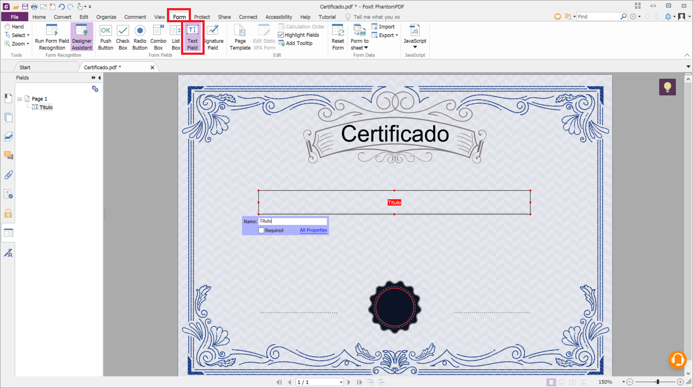
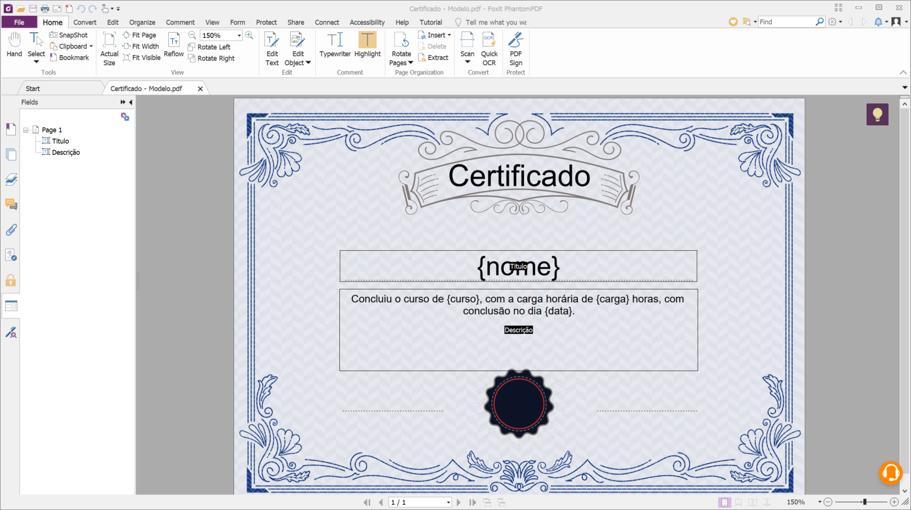
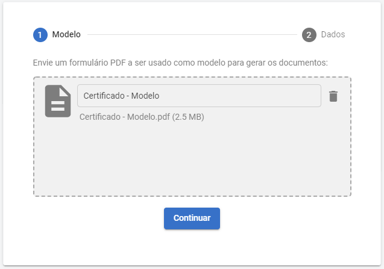
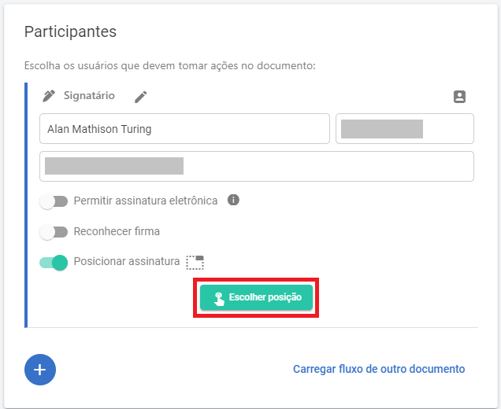
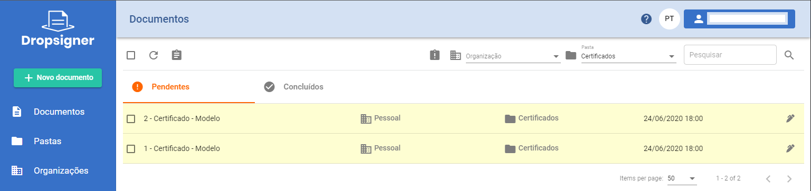
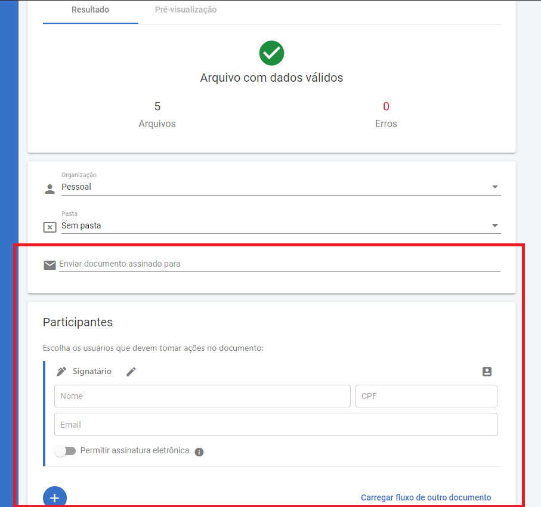

# Lacuna Signer - Geração de documentos

Para gerar documentos PDF a partir de um modelo no [Signer](../index.md), siga os passos abaixo.

## Criando o modelo PDF

Antes de gerar documentos no Signer, é necessário ter um modelo PDF. Um modelo consiste em um documento PDF com campos de formulário editáveis e preenchidos com texto, incluindo marcações dos locais onde o texto específico de cada documento gerado será inserido. Nesse exemplo, será usado o software [PhantomPDF](https://www.foxitsoftware.com/pdf-editor/) para criação do formulário PDF, mas o usuário é livre para escolher qualquer software de sua preferência com essa funcionalidade.

### Adicionando campos de formulário ao PDF
Abra um PDF existente no PhantomPDF, navegue para a seção de *formulário* e selecione a opção de *campo de texto*



Com um clique duplo no campo de formulário é possível escolher opções de aparência e formatação, como tamanho e estilo de fonte. Também é possível preencher o campo com um texto padrão. Nesse campo, digite o texto que deve aparecer nos documentos gerados, usando '{' e '}' para indicar a parte do texto que deve ser substituída pelos dados fornecidos na geração de documentos.


Repita isso para todos os campos que quiser criar e salve o arquivo.



## Gerando documentos no Signer

Na barra lateral do Signer, selecione a opção **Gerar documentos**.


Envie o modelo PDF criado anteriormente e clique em **Continuar**.



Clique em **Baixar modelo CSV** e abra o arquivo baixado no Excel ou em um editor de texto puro.


Cada linha do arquivo CSV representa um documento que será gerado. A coluna **\[filename\]** determina o nome do documento gerado. Caso ela seja deixada em branco, o nome do documento será gerado automaticamente. Cada uma das demais colunas foi gerada automaticamente a partir dos identificadores que aparecem entre chaves nos campos de formulário do modelo enviado. O valor dessas colunas substituirá o identificador correspondente no modelo enviado.

Preencha o arquivo CSV e salve suas alterações.


Envie o arquivo CSV preenchido.


Preencha as demais configurações da mesma maneira que no envio de documentos. É possível determinar a posição da assinatura de cada signatário no modelo.




>[!TIP]
>É recomendado que as assinaturas sejam posicionadas no momento da geração dos documentos. Caso isso não seja feito, as assinaturas de cada um dos documentos gerados podem ficar em posições diferentes.

Após preencher as opções e o fluxo dos documentos da maneira desejada, clique em **Enviar**. Os documentos serão gerados e os participantes serão notificados.



Após as assinaturas, os documentos gerados e assinados estarão disponíveis para download.


## Gerando documentos com fluxos por documento

À partir da versão 1.29.0, é possível gerar documentos definindo um fluxo específico para cada documento a ser gerado. Para isso, devem ser adicionadas novas colunas no arquivo
CSV enviado ao Signer. 

As seções abaixo descrevem os tipos de informações do fluxo que podem ser adicionadas.

### Signatários

Para definir um ou mais signatários, utilize as colunas abaixo adicionando-as ao prefixo `Signer_x.`, onde `x` é o número do signatário:

* Name: o nome do signatário.
* Identifier: o CPF do signatário.
* Email: o email do signatário.
* Phone (opcional): o telefone celular do signatário.
* Step (opcional): ordem do fluxo na qual deve ocorrer esta ação. 
* Title (opcional): título do signatário.
* AllowElectronicSignature (opcional): preencha com `true` para permitir que o signatário assine eletronicamente. Caso contrário, preencha com `false` ou deixe em branco.
* ElectronicType (opcional): tipo de autenticação da assinatura eletrônica. Deve ser usada em conjunto com a opção `AllowElectronicSignature`. Os possíveis valores são:
`SMS`, `AuthenticatorApp` e `Selfie`.
* Signature (opcional): define a posição da imagem de assinatura, no formato `TOP_LEFT_X|TOP_LEFT_Y`, `TOP_LEFT_X|TOP_LEFT_Y|PAGE_NUMBER`, 
`TOP_LEFT_X|TOP_LEFT_Y|WIDTH|HEIGHT` ou `TOP_LEFT_X|TOP_LEFT_Y|WIDTH|HEIGHT|PAGE_NUMBER`. Exemplo: `100.5|85|2`.

Exemplo de assinatura digital:

```
Info1,Info2,Signer_1.Name,Signer_1.Identifier,Signer_1.Email
Value1,Value2,Alice Venture,111.111.111-11,alice@email.com
Value3,Value4,Bob Venture,222.222.222-22,bob@email.com
```

Exemplo de assinatura eletrônica:

```
Info1,Info2,Signer_1.Name,Signer_1.Identifier,Signer_1.Email,Signer_1.AllowElectronicSignature
Value1,Value2,Alice Venture,111.111.111-11,alice@email.com,true
Value3,Value4,Bob Venture,222.222.222-22,bob@email.com,true
```

### Aprovadores

Para definir um ou mais aprovadores, utilize as colunas abaixo adicionando-as ao prefixo `Approver_x.`, onde `x` é o número do aprovador:

* Name: o nome do aprovador.
* Identifier: o CPF do aprovador.
* Email: o email do aprovador.
* Step (opcional): ordem do fluxo na qual deve ocorrer esta ação.

Exemplo:

```
Info1,Info2,Approver_1.Name,Approver_1.Identifier,Approver_1.Email
Value1,Value2,Alice Venture,111.111.111-11,alice@email.com
Value3,Value4,Bob Venture,222.222.222-22,bob@email.com
```

### Observadores

Para definir um ou mais observadores, utilize as colunas abaixo adicionando-as ao prefixo `Observer_x.`, onde `x` é o número do observador:

* Name: o nome do observador.
* Identifier: o CPF do observador.
* Email: o email do observador.

Exemplo:

```
Info1,Info2,Observer_1.Name,Observer_1.Identifier,Observer_1.Email
Value1,Value2,Alice Venture,111.111.111-11,alice@email.com
Value3,Value4,Bob Venture,222.222.222-22,bob@email.com
```

### Emails notificados

Para enviar o documento para uma lista de emails após a conclusão do fluxo, adicione a coluna `NotifiedEmails` separando os emails pelo caractere `|`. 

Exemplo:

```
Info1,Info2,NotifiedEmails
Value1,Value2,alice@email.com
Value3,Value4,alice@email.com|bob@email.com
```

> [!WARNING]
> Ao contrário das outras opções, essa coluna só pode ser adicionada uma vez.


### Fluxos combinados

Ainda é possível definir participantes do fluxo que serão compartilhados para todos os documentos, bastando informá-los no campo de participantes da tela
de geração:



Esses participantes serão combinados com os participantes específicos de cada documento. No entanto, não é possível definir que as ações dos participantes
compartilhados ocorram após as ações dos participantes específicos de cada documento.

## Veja também

* [Guia do usuário](index.md)
