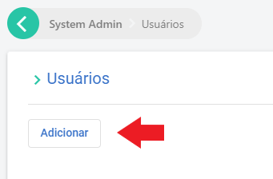
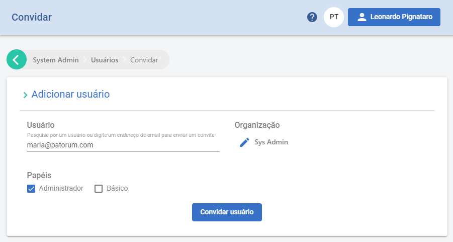

# Adicionando usuário à administração de sistema

[!include[Under construction](../../../includes/under-construction.md)]

Para adicionar um usuário com a função de Administrador do Sistema, vá até a página da **Administração**, disponível no menu do usuário.

Selecione **Usuários**.

Clique em **Adicionar**

É de suma importância que na organização, selecione a organização *sys admin*. Selecione o papel **Administrador**.

Selecione o botão **Convidar usuário**. 

