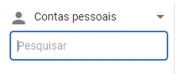
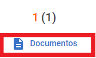
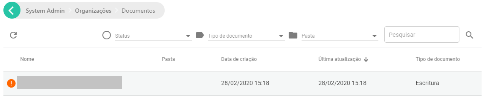

# Visualizando os documentos do sistema

[!include[Under construction](../../../includes/under-construction.md)]

Para obter acesso aos documentos, direcione-se ao menu da administração.

Selecione **Organizações**

Na aba de opções, selecione **Contas Pessoais**. Isto tornará possível visualizar os documentos que cada usuário submeteu.

Digite o nome do usuário que tem interesse em consultar.

Selecione **Documentos**, para visualizar os documentos deste usuário.

É possível então observar todos os documentos que este usuário submeteu ao sistema. 

