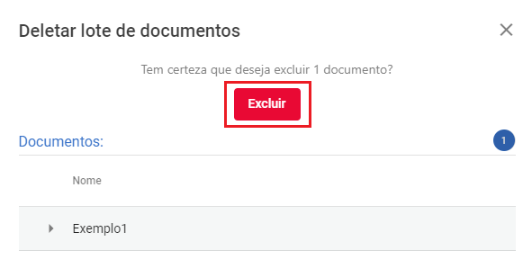

# Excluindo documentos

Para excluir documentos, selecione  **Documentos** na aba do menu principal.

Marque a caixa de seleção do documento que deseja excluir.

Surgirão as opções das ações que podem ser tomadas sobre este documento.

Para excluir, selecione a lixeira. Confirme sua ação selecionando **Excluir**.

Conclua a ação, selecione **Concluir**.

O documento foi excluido com sucesso! 
