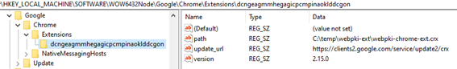
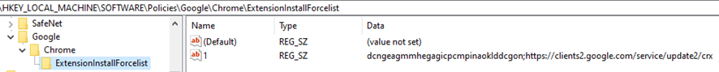
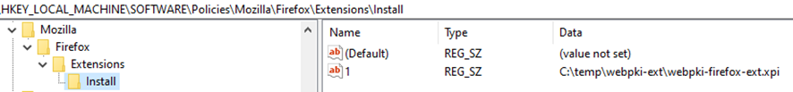

# Instalação e distribuição de componentes do WEB PKI via GPO

Para distribuição automática dos plugins, extraia os arquivos do ZIP 
(webpki-ext.zip) em anexo para um diretório local ou de rede.

Como exemplo, vamos usar o diretório: "C:\temp\webpki-ext"

**Distribuição automática do plugin no Chrome**

Criar uma chave com caminho: HKEY_LOCAL_MACHINE\SOFTWARE\WOW6432Node\Google\Chrome\Extensions\dcngeagmmhegagicpcmpinaoklddcgon

Adicione as *Strings Value*:

```
Name: update_url
Data: https://clients2.google.com/service/update2/crx
```

```
Name: path
Data: C:\temp\webpki-ext\webpki-chrome-ext.crx
```

```
Name: version
Data: 2.15.0
```

Como na imagem abaixo:



Criar uma chave com caminho: HKEY_LOCAL_MACHINE\SOFTWARE\Policies\Google\Chrome\ExtensionInstallForcelist

E adicionar uma String Value

```
Name: 1 (ou o próximo inteiro sequencial se já houver)
Data: dcngeagmmhegagicpcmpinaoklddcgon;https://clients2.google.com/service/update2/crx
```

Como na imagem abaixo:



**Distribuição automática do plugin no Firefox**

Criar uma chave com caminho: HKEY_LOCAL_MACHINE\Software\Policies\Mozilla\Firefox\Extensions\Install

E adicionar uma String Value:

```
Name: 1 (ou o próximo inteiro sequencial se já houver)
Data: C:\temp\webpki-ext\webpki-firefox-ext.xpi
```

Como na imagem abaixo:



**Distribuição automática da aplicação nativa**

Baixar o instalador MSI do link e distribuir via GPO:

https://get.webpkiplugin.com/downloads/latest/setup-win-pt

## Próximos passos

* Veja os [browser suportados](browser-support.md)
* Veja como funciona o [licenciamento](licensing.md)
* Veja [como customizar o comportamento quando o componente não estiver instalado](customizing-not-installed.md)